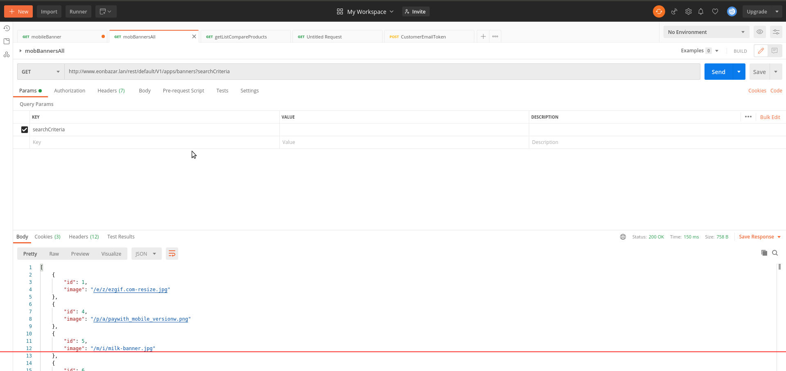
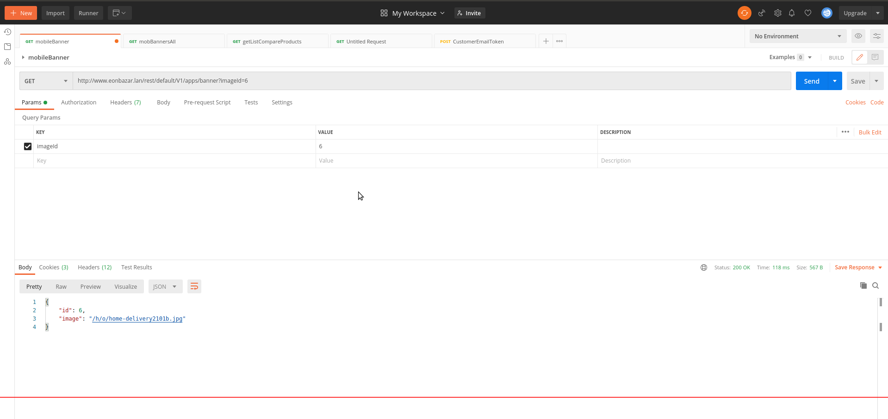

## Magento 2 EonInfosys_MobileBanner

EonInfosys_MobileBanner for apps(iOS/Andriod) banner list control from admin panel for slideshow

Methods: Get
Url: http://www.eonbazar.lan/rest/default/V1/apps/banners?searchCriteria [all]
http://www.eonbazar.lan/rest/default/V1/apps/banner?imageId=6  [byId]

### Developer

Thank you for watching guide.If you have any questions about this practice, please feel free to leave a comment or Please do not hesitate to contact me don't worry about charge I try to help  on my little knowledge, if you need me to join your Magento project especially extension development.

- Abdul Matin

- Skype/gmail/hangout:matinict

- Mobile/What-apps: +8801717676441

- Github: https://github.com/matinict

- Magento Developer Program Member & Community Contributors
